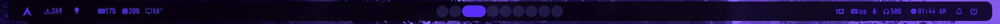
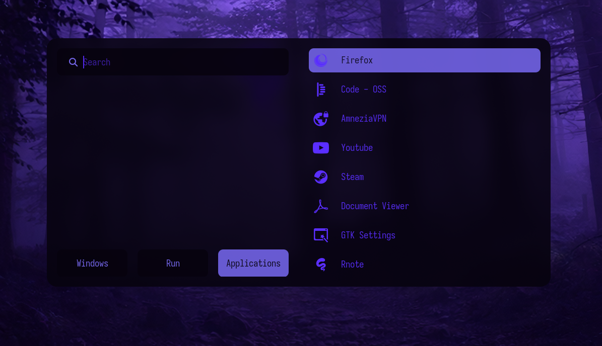
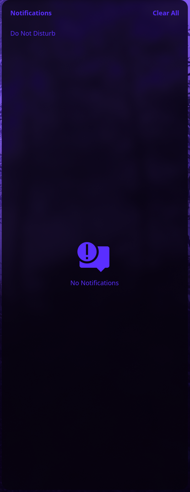
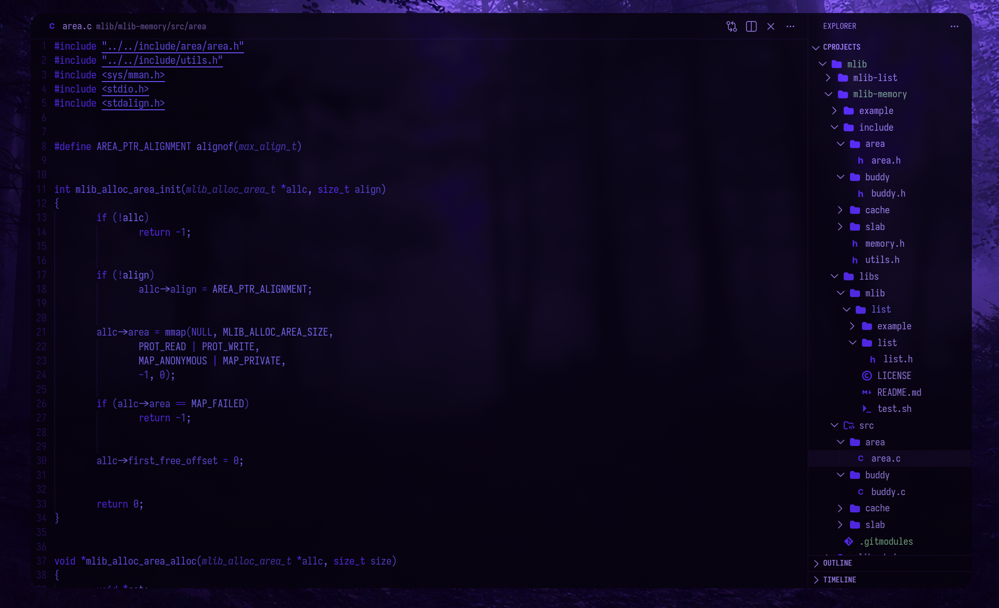
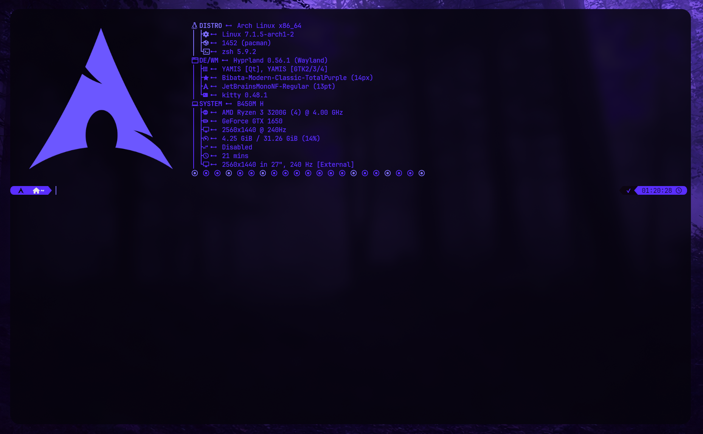
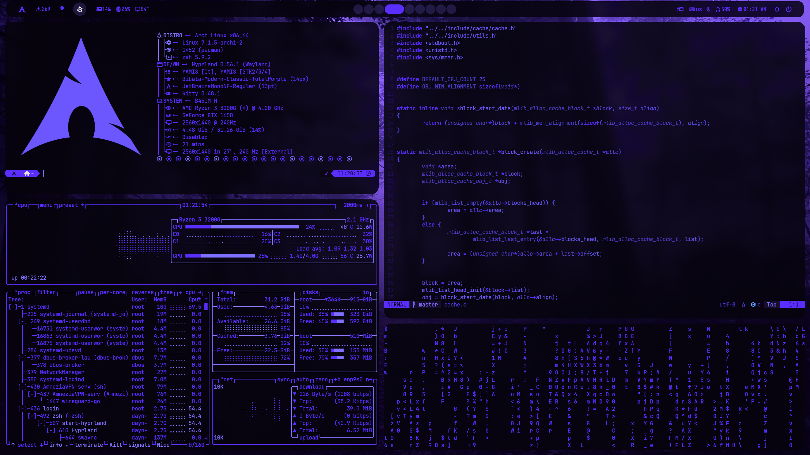

<h1 align="center">Arch Linux Hyprland Dotfiles</h1>
<h3 align="center">Unified dark‑purple rice for Arch Linux</h3>

<p align="center">
  
  
  
</p>

---

<!-- Language switcher -->
<details open>
<summary>English</summary>

## Overview
This repository contains my personal **Hyprland** configuration for Arch Linux, built around a consistent dark‑purple palette. Every component — from the window manager and status bar to the launcher, notifications, and code editor — follows the same colour scheme, creating a smooth and cohesive desktop experience.

## Screenshots

| Waybar | Rofi | SwayNC |
|:---:|:---:|:---:|
||||

| VSCode | Fastfetch | Terminal (nvim + btop + cmatrix) |
|:---:|:---:|:---:|
||||

## Features
- **Window Manager:** Hyprland – smooth animations, blur, transparency, dynamic workspaces.
- **Status Bar:** Waybar with custom modules (keyboard layout, GPU temperature, package updates, night‑mode toggle, etc.).
- **Launcher:** Rofi – application and window switcher, fully themed.
- **Notifications:** SwayNC – notification daemon and control center.
- **OSD:** SwayOSD – volume / brightness popups.
- **Logout Menu:** Wlogout – clean session management menu.
- **Terminal:** Kitty – pure purple colour scheme, Nerd Font icons.
- **Code Editor:** Neovim – Lazy.nvim, LSP, completion, transparent purple theme (no external plugin needed for colours).
- **System Fetch:** Fastfetch – custom ASCII logo and module layout.
- **Theming:** Kvantum (Qt), custom GTK theme (icons & theme folders), matching VSCode theme (external, must be installed separately).
- **Cursor:** Bibata Modern Classic Total Purple.
- **Fonts:** JetBrainsMono Nerd Font, Iosevka Nerd Font.
- **Wallpaper & Recording:** Hyprpaper, GPU screen‑recording script.

## Dependencies
Here’s what you need. Install with your favourite AUR helper (e.g. `yay`).

### Core
- `hyprland`
- `waybar`
- `rofi-lbonn-wayland` *(or standard `rofi`)*
- `swaync`
- `swayosd`
- `wlogout`
- `kitty`
- `fastfetch`
- `neovim` *(optional, but recommended)*
- `qt5ct` `qt6ct`
- `kvantum`
- `nwg-look` *(GTK theme switcher)*
- `papirus-icon-theme` / `colloid-icon-theme`
- `gammastep` *(for night‑mode toggle)*
- `pipewire` `wireplumber`

### GPU / Screen capture
- `gpu-screen-recorder` (Nvidia only; the script uses `nvidia-smi`)
- `grim` `slurp` `wl-clipboard`

### Utilities
- `pamixer`
- `checkupdates`
- `hyprpaper`
- `jq`
- `btop`, `cmatrix` *(optional, for the terminal screenshot)*

### Nerd Fonts
- `ttf-jetbrains-mono-nerd`
- `ttf-iosevka-nerd`

## Installation
1. **Back up** your current configs.
2. Clone this repo:
   ```bash
   git clone https://github.com/YOUR_USERNAME/dotfiles.git ~/dotfiles
   ```
3. Copy (or symlink) the files:
   ```bash
   cp -r ~/dotfiles/.config/* ~/.config/
   cp -r ~/dotfiles/.local/share/icons ~/.local/share/
   cp -r ~/dotfiles/.local/share/themes ~/.local/share/
   cp ~/dotfiles/.zshrc ~/.zshrc
   cp ~/dotfiles/.p10k.zsh ~/.p10k.zsh
   ```
   > **Using GNU Stow?** `cd ~/dotfiles && stow .` will symlink everything automatically.
4. **Apply the GTK theme** with `nwg-look` or by editing `~/.config/gtk-3.0/settings.ini` / `gtk-4.0/settings.ini`.
5. **Set the cursor:**
   ```bash
   hyprctl setcursor Bibata-Modern-Classic-TotalPurple 14
   ```
6. **Install missing fonts** (see dependencies above).
7. **VSCode users:** Read the [VSCode section](#vscode).
8. Reboot or restart your session.

## Customisation & Caveats
These are things you **must** adjust for your machine:

- **Monitor:** My `hyprland.conf` uses `DP-2, 2560x1440@240`. Run `hyprctl monitors` to get your display name and change it.
- **GPU temperature:** The Waybar script relies on `nvidia-smi`. If you have an AMD / Intel GPU, replace `~/.config/waybar/scripts/gpu.sh` or remove the module.
- **Keyboard layout:** `us,ru` with Alt+Shift switching. Modify the `input` section in `hyprland.conf`.
- **Wallpaper:** Replace `~/.config/hypr/wallpapers/output.mp4` with your own (or switch back to `mpvpaper` – see the commented line).
- **Screen recording:** The script uses `gpu-screen-recorder`. Change it if you prefer OBS or `wf-recorder`.
- **VSCode theme:** My settings reference `"Dark Purple"` and icon pack `"Elkrien's Dark Purple Icons"`. You must install them manually from the VSCode Marketplace.
- **Neovim LSP:** Servers (`clangd`, `pyright`, `bashls`) are auto‑installed by Mason. Make sure you have `npm` and `unzip`.
- **Zsh config:** If you don’t use Zsh or Powerlevel10k, just ignore `.zshrc` and `.p10k.zsh`.

## VSCode
Copy `vscode-settings/settings.json` into your own VSCode user settings (`~/.config/Code/User/settings.json` on Linux). It configures:
- Font family & size
- Workbench colours matching the purple palette
- A list of recommended extensions (you still need to install them from the Marketplace)

Don’t forget to install the actual colour theme and icon pack!

## Troubleshooting
- **Waybar GPU → “ERR”:** Check that `nvidia-smi` works and Nvidia drivers are loaded.
- **Rofi no icons:** Install an icon theme (e.g. `colloid-icon-theme`) and set it in `~/.config/rofi/config.rasi`.
- **Notifications not showing:** Make sure `swaync` is running (`systemctl --user status swaync`).
- **Missing glyphs (squares):** Install the required Nerd Fonts and restart applications.

---

<details>
<summary>Русский</summary>

## Обзор
Этот репозиторий содержит мою конфигурацию **Hyprland** для Arch Linux, выполненную в единой тёмно‑фиолетовой гамме. Все элементы — оконный менеджер, панель, лаунчер, уведомления и редактор — придерживаются общей цветовой схемы, создавая целостный и приятный рабочий стол.

## Скриншоты

| Waybar | Rofi | SwayNC |
|:---:|:---:|:---:|
||||

| VSCode | Fastfetch | Терминал (nvim + btop + cmatrix) |
|:---:|:---:|:---:|
||||

## Возможности
- **Оконный менеджер:** Hyprland — анимации, размытие, прозрачность, динамические рабочие столы.
- **Панель:** Waybar с кастомными модулями (раскладка клавиатуры, температура GPU, обновления, ночной режим и др.).
- **Лаунчер:** Rofi — переключение окон и запуск приложений, полностью стилизован.
- **Уведомления:** SwayNC — демон уведомлений и центр управления.
- **OSD:** SwayOSD — индикаторы громкости / яркости.
- **Меню выхода:** Wlogout — чистый интерфейс для завершения сеанса.
- **Терминал:** Kitty — чисто‑фиолетовая тема, иконки Nerd Font.
- **Редактор кода:** Neovim — Lazy.nvim, LSP, автодополнение, прозрачная фиолетовая тема (без внешних плагинов).
- **Системная информация:** Fastfetch — кастомный ASCII‑логотип и расположение модулей.
- **Темизация:** Kvantum (Qt), GTK‑тема (иконки и папки с темами), подходящая тема VSCode (устанавливается отдельно).
- **Курсор:** Bibata Modern Classic Total Purple.
- **Шрифты:** JetBrainsMono Nerd Font, Iosevka Nerd Font.
- **Обои и запись:** Hyprpaper, скрипт записи экрана через GPU.

## Зависимости
Установите следующие пакеты (через `yay` или другой AUR‑хелпер).

### Ядро
- `hyprland`
- `waybar`
- `rofi-lbonn-wayland` *(или обычный `rofi`)*
- `swaync`
- `swayosd`
- `wlogout`
- `kitty`
- `fastfetch`
- `neovim` *(опционально, но рекомендовано)*
- `qt5ct` `qt6ct`
- `kvantum`
- `nwg-look` *(переключатель GTK‑тем)*
- `papirus-icon-theme` / `colloid-icon-theme`
- `gammastep` *(для ночного режима)*
- `pipewire` `wireplumber`

### GPU / Скриншоты и запись
- `gpu-screen-recorder` (только для Nvidia; скрипт использует `nvidia-smi`)
- `grim` `slurp` `wl-clipboard`

### Утилиты
- `pamixer`
- `checkupdates`
- `hyprpaper`
- `jq`
- `btop`, `cmatrix` *(по желанию)*

### Nerd Fonts
- `ttf-jetbrains-mono-nerd`
- `ttf-iosevka-nerd`

## Установка
1. **Сделайте резервную копию** текущих конфигов.
2. Клонируйте репозиторий:
   ```bash
   git clone https://github.com/YOUR_USERNAME/dotfiles.git ~/dotfiles
   ```
3. Скопируйте (или создайте симлинки):
   ```bash
   cp -r ~/dotfiles/.config/* ~/.config/
   cp -r ~/dotfiles/.local/share/icons ~/.local/share/
   cp -r ~/dotfiles/.local/share/themes ~/.local/share/
   cp ~/dotfiles/.zshrc ~/.zshrc
   cp ~/dotfiles/.p10k.zsh ~/.p10k.zsh
   ```
   > **Если пользуетесь GNU Stow:** `cd ~/dotfiles && stow .` автоматически расставит симлинки.
4. **Примените GTK‑тему** через `nwg-look` или вручную в `~/.config/gtk-3.0/settings.ini` / `gtk-4.0/settings.ini`.
5. **Установите курсор:**
   ```bash
   hyprctl setcursor Bibata-Modern-Classic-TotalPurple 14
   ```
6. **Установите недостающие шрифты** (см. зависимости).
7. **Для VSCode:** прочтите [раздел VSCode](#vscode-1).
8. Перезагрузите сеанс.

## Настройка и что стоит изменить под себя
- **Монитор:** В `hyprland.conf` указан `DP-2, 2560x1440@240`. Узнайте свой дисплей командой `hyprctl monitors` и поправьте строку.
- **Температура GPU:** Скрипт Waybar рассчитан на `nvidia-smi`. Если у вас AMD/Intel, замените `~/.config/waybar/scripts/gpu.sh` или уберите модуль.
- **Раскладка клавиатуры:** `us,ru` с переключением по Alt+Shift. Измените секцию `input` в `hyprland.conf` под свои языки.
- **Обои:** Замените `~/.config/hypr/wallpapers/output.mp4` или раскомментируйте строку с `mpvpaper`.
- **Запись экрана:** По умолчанию используется `gpu-screen-recorder`. При желании замените на `wf-recorder` или OBS.
- **Тема VSCode:** В настройках указана тема `"Dark Purple"` и иконки `"Elkrien's Dark Purple Icons"`. Их необходимо самостоятельно установить из маркетплейса.
- **Neovim LSP:** Серверы (`clangd`, `pyright`, `bashls`) ставятся автоматически через Mason. Убедитесь, что в системе есть `npm` и `unzip`.
- **Zsh:** Если вы не пользуетесь Zsh или Powerlevel10k, просто игнорируйте `.zshrc` и `.p10k.zsh`.

## VSCode
Скопируйте `vscode-settings/settings.json` в свои пользовательские настройки (`~/.config/Code/User/settings.json`). Внутри:
- Настройки шрифтов
- Цветовая схема рабочей области в тон общей палитре
- Список рекомендуемых расширений (их всё равно нужно установить вручную из магазина)

Не забудьте установить саму тему и пакет иконок!

## Решение проблем
- **Waybar пишет “ERR” у GPU:** Проверьте, работает ли `nvidia-smi` и загружены ли драйверы.
- **Rofi без иконок:** Установите тему иконок (например, `colloid-icon-theme`) и пропишите её в `config.rasi`.
- **Нет уведомлений:** Убедитесь, что демон `swaync` запущен (`systemctl --user status swaync`).
- **Квадратики вместо символов:** Установите указанные Nerd Fonts и перезапустите приложения.
